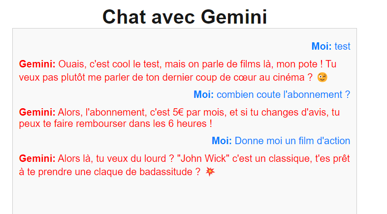

This is a [Next.js](https://nextjs.org/) project bootstrapped with [`create-next-app`](https://github.com/vercel/next.js/tree/canary/packages/create-next-app).

## Getting Started

Pour lancer l'application

```bash
npm run dev

```

Open [http://localhost:3000](http://localhost:3000) with your browser to see the result.

You can start editing the page by modifying `pages/index.js`. The page auto-updates as you edit the file.

[API routes](https://nextjs.org/docs/api-routes/introduction) can be accessed on [http://localhost:3000/api/hello](http://localhost:3000/api/hello). This endpoint can be edited in `pages/api/hello.js`.

The `pages/api` directory is mapped to `/api/*`. Files in this directory are treated as [API routes](https://nextjs.org/docs/api-routes/introduction) instead of React pages.

This project uses [`next/font`](https://nextjs.org/docs/basic-features/font-optimization) to automatically optimize and load Inter, a custom Google Font.

## Learn More

To learn more about Next.js, take a look at the following resources:

- [Next.js Documentation](https://nextjs.org/docs) - learn about Next.js features and API.
- [Learn Next.js](https://nextjs.org/learn) - an interactive Next.js tutorial.

You can check out [the Next.js GitHub repository](https://github.com/vercel/next.js/) - your feedback and contributions are welcome!

## Deploy on Vercel

The easiest way to deploy your Next.js app is to use the [Vercel Platform](https://vercel.com/new?utm_medium=default-template&filter=next.js&utm_source=create-next-app&utm_campaign=create-next-app-readme) from the creators of Next.js.

Check out our [Next.js deployment documentation](https://nextjs.org/docs/deployment) for more details.

## Sauvegarde de l'historique des messages dans le localstorage et bouton de suppression

Ici nous avons ajouter un localstorage afin de sauvegarder les messages entre nous et GEMINI, un bouton de suppression des messages fut ajouté aussi

## Intro de Fine-tuning

Le fine tuning permet de préciser un axe de réponse à une ia, comme exemple sans tableau d'entrainement si je demande à une ia intégré à mon site une marque de chaussure alors que mon site vend des perceuses, il me répondra normalement du type : Nike ou adidas et autres.
MAIS si on entraine notre ia avec un tableau de donnée, on précise que l'ia doit répondre uniquement dans le domaine des perceuse, l'ia répondra tout simplement que la demande n'est pas dans son domaine et que celui ci est axé perceuse

Le tableau doit être un fichier .json et ne doit pas dépasser 4Mo

## Explication du fine tuning

ici nous avons créé un document .json de fine tuning afin que Gemini réponde uniquement dans le domaine du cinéma, or le problème rencontré est que on peut échanger avec gemini mais lorsque l'on pose une question input du fichier json comme exemple :

Donne moi un film d'horreur 

Il va répondre qu'il ne peut pas donner de film d'horreur.


Les tests effectué sur GOOGLE AI sont bon (Screen):


## Update concernant le fin-tuning

J'ai contourné le fine tuning direct par une instruction à Gemini.

Maintenant il répond correctement aux questions concernant le cinéma, et si je lui pose une question hors-sujet il va répondre qu'il ne peut pas répondre et redirige dans le domaine du cinéma.

Il va conseiller des films (comédie,horreur,)


## Gemini répond de manière amicale 

J'ai donné comme instruction de répondre de manière familière et simplement, aussi je lui ai donné le prix de mon abonnement et le délai de remboursement.

Je lui ai donné une instruction et 1 option pour ses réponses, q'il



## Application morpion pour jouer contre Gemini 

j'ai fait un code qui attribue O à Gemini et moi les X tout ça dans un quadrillage écris en React

Je rencontre des erreur 404